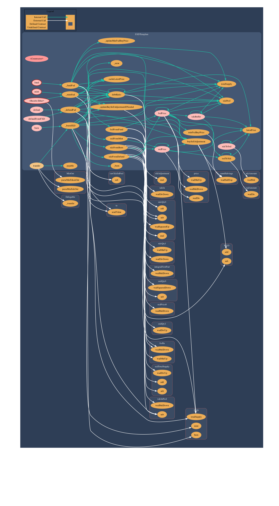

  `this is an in-progess project please refer to main branch for last updates`
<h1 align="center"> Stable XDC </h1>
<h4 align="center"> a minimalist Stable XDC token </h4>



<p align="center">
  <a href="#key-features">Introduction</a> •
  <a href="#key-features">Key Features</a> •
  <a href="#how-to-use">How To Use</a> •
  <a href="#Smart Contract Deployment">Smart Contract Deployment</a> •
  <a href="#Future work">Future work</a> •
  <a href="#license">License</a>
</p>

## Introduction
 SXD a minimalist Stable XDC token, its the The simplest possible stablecoin which  create/redeem token backed by a pool of XDC. You mint n new “SXD” stablecoin units by depositing $n worth of XDC (as of the time of minting) into the pool, and burn m SXD in exchange for $m worth of XDC (as of the time of burning) from the pool.
 
 to counter the volitile nature of XDC, SXD uses the well familiar overcollateralize of the pool giving it a safety buffer, with more XDC than is needed to redeem the outstanding SXD. To do this, the system needs a way for other participants — “funders” — to add XDC to the pool (in exchange for a second token, FXD — “funding XDC”), and an incentive for them to do so. Let’s try two incentives:
 
 1. Fees. Charge small fees on mint/burn operations, and share them between the funders.
2. Leverage. We have a pool of XDC with market risk (its value rises and dips with the price of XDC), backing a bunch of SXD tokens whose sole purpose in life is to avoid that risk (stay priced at $1). So we’ll dump all that market risk on the funders: stablecoin users deposit risky XDC, get back (market!-)riskless SXD; funders deposit risky XDC, get back even-riskier FXD. This is again a familiar financial technique — “tranching” the risk.

So now, on top of mint (XDC->SXD) and burn (SXD->XDC) operations to create/redeem SXD tokens, we add fund (XDC->FXD) and defund (FXD->XDC) operations to create/redeem FXD.
 
 
 
## Key Features

* SXD is pegged to United States dollar, and maintains its stable value by minting SXD in exchange for xdc, using the price of XDC at the time of minting. which is known asn as  **CDP: Collateralised Debt Position**. 

## How To Use

To clone and run this project , you'll need [Git](https://git-scm.com) and [Node.js](https://nodejs.org/en/download/) (which comes with [npm](http://npmjs.com)) installed on your computer. From your command line:

```bash
# Clone this repository
$ git https://github.com/malawadd/sxd

# Go into the repository
$ cd sxd

# Install dependencies
$ npm install

# deploy the contracts 
$ npx hardhat --network testnet  scripts/deploy.js
```

> **Note**
> If you're using Linux Bash for Windows, [see this guide](https://docs.microsoft.com/en-us/windows/dev-environment/javascript/nodejs-on-wsl) or use `node` from the command prompt.


## Smart Contract Deployment

SXD is released on the XDC mainnet and **I do not recoomend** anyone to use it in its current form. its still requires a lot of imporovemnt. currently I'm using mock oracle smart contract to set the price , so this is only for the purpose of testing. 

* Oracle aggregator : [0xD0a999DB766c1a41Db113f725a851eb3ea6A2b3a](https://xdcscan.io/address/xdcd0a999db766c1a41db113f725a851eb3ea6a2b3a#transactions)
* Oracle anchoredView : [0x7771117a5171B643C0aDaEfa863703ac929c2Ccf](https://xdcscan.io/address/xdc7771117a5171b643c0adaefa863703ac929c2ccf#transactions)
* Oracle oraclePair : [0x532C88424404a10A41A1a3bbD6016Aa0b27c909D](https://xdcscan.io/address/xdc532c88424404a10a41a1a3bbd6016aa0b27c909d#transactions)
* SXD : [0xaaa17A76C38A071a4EFC0788a892FB0146BA36eA](https://xdcscan.io/address/xdcaaa17a76c38a071a4efc0788a892fb0146ba36ea#transactions)
* FXD:[0x5AEeDc64647270e8a84aDC95A532699F5A3F93B1](https://xdcscan.io/address/xdc5aeedc64647270e8a84adc95a532699f5a3f93b1#transactions)

## Future work:

work with real oracles, or develop them. 


## License

MIT